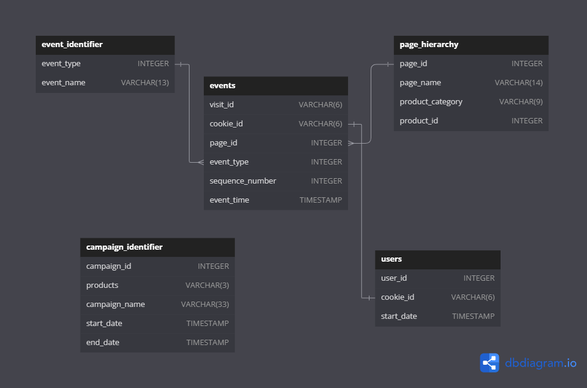

# Clique-Bait-SQL-Challenge-Case-Study-6
<p align = "center">

</p>

In this repository, you will find my solutions for the 3rd challenge of [8 Week Challenge](https://8weeksqlchallenge.com/) which is [Clique-Bait](https://8weeksqlchallenge.com/case-study-6/) Challenge.
## Table of Content
1. [Business Case](#business-case)
2. [Available Data](#available-data)
3. [Questions and Solutions](#questions-and-solutions)

## Business Case
Clique Bait is not like your regular online seafood store - the founder and CEO Danny, was also a part of a digital data analytics team and wanted to expand his knowledge into the seafood industry!

In this case study - you are required to support Danny's vision and analyse his dataset and come up with creative solutions to calculate funnel fallout rates for the Clique Bait online store.

## Available Data
For this case study there is a total of 5 datasets which we will need to combine to solve these questions.

<p align = "center">
</img></p>

### `users` table 
<Details>
    <summary>Table Details</summary>
&nbsp;
  
* Customers who visit the Clique Bait website are tagged via their `cookie_id`.

</Details>

### `events` table
<Details>
    <summary>Table Details</summary>
&nbsp;  

* Customer visits are logged in this events table at a `cookie_id` level and the `event_type` and `page_id` values can be used to join onto relevant satellite tables to obtain further information about each event.

* The `sequence_number` is used to order the events within each visit.

</Details>

### `event identifier` table
<Details>
    <summary>Table Details</summary>
&nbsp;

* The `event_identifier` table shows the types of events which are captured by Clique Bait's digital data systems.

</Details>

### `campaign identifier` table
<Details>
    <summary>Table Details</summary>
&nbsp;  

* This table shows information for the 3 campaigns that Clique Bait has ran on their website so far in 2020.

</Details>

### `page hierarchy` table
<Details>
    <summary>Table Details</summary>
&nbsp;  

 * This table lists all of the pages on the Clique Bait website which are tagged and have data passing through from user interaction events.
</Details>


## Questions and Solutions
### Digital Analysis
Using the available datasets - answer the following questions using a single query for each one:
#### 1. How many users are there?

```sql 
SELECT COUNT(DISTINCT user_id) AS total_users
  FROM users
```
|total_users|
|-----------|
|500        |


#### 2. How many cookies does each user have on average?

```sql
SELECT ROUND(COUNT(DISTINCT cookie_id))/COUNT(DISTINCT user_id), 1) AS avg_cookies_per_user
  FROM users
```
|avg_cookies_per_user|
|--------------------|
|3.6                 |


#### 3. What is the unique number of visits by all users per month?

```sql
SELECT MONTH(event_time) as 'month',
       COUNT(DISTINCT visit_id) as total_visits
  FROM events
 GROUP BY MONTH(event_time);    
```
|month|total_visits|
|-----|------------|
|1    |876         |
|2    |1488        |
|3    |916         |
|4    |248         |
|5    |36          |


#### 4. What is the number of events for each event type?

```sql
SELECT i.event_name,
       COUNT(e.visit_id) AS total_visits
  FROM events AS e 
  JOIN event_identifier AS i ON i.event_type = e.event_type
 GROUP BY i.event_name
 ORDER BY total_visits DESC
```
|event_name|total_visits|
|----------|------------|
|Page View |20928       |
|Add to Cart|8451        |
|Purchase  |1777        |
|Ad Impression|876         |
|Ad Click  |702         |


#### 5. What is the percentage of visits which have a purchase event?

```sql
SELECT round(sum(case when ei.event_name = 'Purchase' then 1 else 0 end)*100/count(distinct e.visit_id),1) as purchase_perc
From events e join event_identifier ei on e.event_type = ei.event_type;
```
|purchase_perc|
|-------------|
|49.9         |


#### 6. What is the percentage of visits which view the checkout page but do not have a purchase event?

```sql
WITH cte AS (
	SELECT e.visit_id,
		   MAX(CASE WHEN ei.event_name = 'Page view' AND ph.page_name = 'checkout' THEN 1 ELSE 0 END) AS viewed_checkout,
		   MAX(CASE WHEN ei.event_name = 'Purchase' THEN 1 ELSE 0 END) AS purchased
	  FROM events AS e 
      JOIN event_identifier AS ei ON e.event_type = ei.event_type 
      JOIN page_hierarchy AS ph ON e.page_id = ph.page_id 
	 GROUP BY e.visit_id
     ORDER BY 3
)
SELECT ROUND((SUM(viewed_checkout)-SUM(purchased))*100/SUM(viewed_checkout), 2) AS viewed_without_purchase_perc
  FROM cte;
```
|viewed_without_purchase_perc|
|----------------------------|
|15.50                       |


#### 7. What are the top 3 pages by number of views?
```sql
SELECT ph.page_name, 
       COUNT(visit_id) AS total_views 
  FROM events AS e 
  JOIN page_hierarchy AS ph ON e.page_id = ph.page_id
 GROUP BY ph.page_name 
 ORDER BY total_views DESC
 LIMIT 3;
```
|page_name|total_views|
|---------|-----------|
|All Products|4752       |
|Lobster  |2515       |
|Crab     |2513       |

			
#### 8. What is the number of views and cart adds for each product category?
```sql
SELECT ph.product_category, 
	   SUM(CASE WHEN event_name = 'Page View' THEN 1 ELSE 0 END) AS total_views,
       SUM(CASE WHEN event_name = 'Add to Cart' THEN 1 ELSE 0 END) AS total_cart_ad
  FROM events AS e 
  JOIN event_identifier AS ei ON e.event_type = ei.event_type 
  JOIN page_hierarchy AS ph ON e.page_id = ph.page_id
 WHERE product_category IS NOT NULL
 GROUP BY product_category;
```
|product_category|total_views|total_cart_ad|
|----------------|-----------|-------------|
|Luxury          |3032       |1870         |
|Shellfish       |6204       |3792         |
|Fish            |4633       |2789         |
    
#### 9. What are the top 3 products by purchases?
```sql
WITH cte1 AS (
  SELECT DISTINCT visit_id AS purchase_id
    FROM events AS e 
    JOIN event_identifier AS ei ON e.event_type = ei.event_type
   WHERE ei.event_name = 'Purchase'
),
cte2 AS (
  SELECT ph.page_name,
         ph.page_id,
         e.visit_id 
    FROM events AS e
    LEFT JOIN page_hierarchy AS ph ON ph.page_id = e.page_id
	JOIN event_identifier AS ei ON e.event_type = ei.event_type
   WHERE ph.product_id IS NOT NULL AND ei.event_name = 'Add to Cart'
)
SELECT page_name AS Product,
       COUNT(*) AS Quantity_purchased
  FROM cte1 
  LEFT JOIN cte2 ON visit_id = purchase_id 
 GROUP BY page_name
 ORDER BY COUNT(*) DESC 
 LIMIT 3;
```
|Product|Quantity_purchased|
|-------|------------------|
|Lobster|754               |
|Oyster |726               |
|Crab   |719               |

### Product Funnel Analysis
#### 1. Using a single SQL query - create a new output table which has the following details: How many times was each product viewed? How many times was each product added to cart? How many times was each product added to a cart but not purchased (abandoned)? How many times was each product purchased?
```sql
CREATE TABLE product_summary AS (
WITH views_and_cart AS (
	SELECT e.visit_id, 
		   ph.page_name,
           SUM(CASE WHEN ei.event_name = 'Page View' THEN 1 ELSE 0 END) AS views,
           sSUM(CASE WHEN ei.event_name = 'Add to Cart' THEN 1 ELSE 0 END) AS add_to_cart
	  FROM events AS e 
      JOIN page_hierarchy AS ph ON e.page_id = ph.page_id 
	  JOIN event_identifier AS ei ON e.event_type = ei.event_type
	 WHERE ph.product_id IS NOT NULL
	 GROUP BY e.visit_id, ph.page_name
),
purchase_events AS (
	SELECT DISTINCT visit_id
      FROM events AS e 
      JOIN event_identifier AS ei ON e.event_type = ei.event_type
     WHERE ei.event_name = 'Purchase'
),
combined_table AS (
	SELECT vc.*, 
	       CASE WHEN pe.visit_id IS NOT NULL THEN 1 ELSE 0 END AS purchased
	  FROM views_and_cart AS vc 
      LEFT JOIN purchase_events AS pe ON vc.visit_id = pe.visit_id
)
SELECT page_name,
	   SUM(views) AS total_views,
       SUM(add_to_cart) AS total_cart_add,
       SUM(CASE WHEN add_to_cart = 1 AND purchased = 0 THEN 1 ELSE 0 END) AS total_add_no_purchase,
       SUM(CASE WHEN add_to_cart = 1 AND purchased = 1 THEN 1 ELSE 0 END) AS total_purchases
  FROM combined_table
  GROUP BY page_name
)
SELECT *
  FROM product_summary;
```
|page_name|total_views|total_cart_add|total_add_no_purchase|total_purchases|
|---------|-----------|--------------|---------------------|---------------|
|Russian Caviar|1563       |946           |249                  |697            |
|Lobster  |1547       |968           |214                  |754            |
|Crab     |1564       |949           |230                  |719            |
|Oyster   |1568       |943           |217                  |726            |
|Kingfish |1559       |920           |213                  |707            |
|Tuna     |1515       |931           |234                  |697            |
|Black Truffle|1469       |924           |217                  |707            |
|Abalone  |1525       |932           |233                  |699            |
|Salmon   |1559       |938           |227                  |711            |


#### Additionally, create another table which further aggregates the data for the above points but this time for each product category instead of individual products.

```sql
CREATE TABLE category_summary AS (
WITH views_and_cart AS (
	SELECT e.visit_id, 
		   ph.product_category,
           ph.page_name,
           SUM(CASE WHEN ei.event_name = 'Page View' THEN 1 ELSE 0 END) AS views,
           SUM(CASE WHEN ei.event_name = 'Add to Cart' THEN 1 ELSE 0 END) AS add_to_cart
	  FROM events AS e 
      JOIN page_hierarchy AS ph ON e.page_id = ph.page_id 
      JOIN event_identifier AS ei ON e.event_type = ei.event_type
	 WHERE ph.product_id IS NOT NULL
	 GROUP BY e.visit_id, ph.product_category, ph.page_name
),
purchase_events AS (
	SELECT DISTINCT visit_id
      FROM events AS e 
      JOIN event_identifier AS ei ON e.event_type = ei.event_type
     WHERE ei.event_name = 'Purchase'
),
combined_table AS (
	SELECT vc.*, 
	       CASE WHEN pe.visit_id IS NOT NULL THEN 1 ELSE 0 END AS purchased
	  FROM views_and_cart AS vc 
      LEFT JOIN purchase_events AS pe ON vc.visit_id = pe.visit_id
)
SELECT product_category,
	   SUM(views) AS total_views,
       SUM(add_to_cart) AS total_cart_add,
       SUM(CASE WHEN add_to_cart = 1 AND purchased = 0 THEN 1 ELSE 0 END) AS total_add_no_purchase,
       SUM(CASE WHEN add_to_cart = 1 AND purchased = 1 THEN 1 ELSE 0 END) AS total_purchases
  FROM combined_table
 GROUP BY product_category
);
```
|product_category|total_views|total_cart_add|total_add_no_purchase|total_purchases|
|----------------|-----------|--------------|---------------------|---------------|
|Luxury          |3032       |1870          |466                  |1404           |
|Shellfish       |6204       |3792          |894                  |2898           |
|Fish            |4633       |2789          |674                  |2115           |

#### Use your 2 new output tables - answer the following questions: Which product had the most views, cart adds and purchases?
```sql
SELECT page_name AS product_with_most_views
  FROM product_summary
 WHERE total_views = (SELECT MAX(total_views) FROM product_summary);
```
|product_with_most_views|
|-----------------------|
|Oyster                 |

```sql
SELECT page_name AS product_with_most_cart_adds
  FROM product_summary
 WHERE total_cart_add = (SELECT MAX(total_cart_add) FROM product_summary);
```
|product_with_most_cart_adds|
|---------------------------|
|Lobster                    |

```sql
SELECT page_name AS product_with_most_pruchases
  FROM product_summary
 WHERE total_purchases = (SELECT MAX(total_purchases) FROM product_summary);
```
|product_with_most_pruchases|
|---------------------------|
|Lobster                    |

#### Which product was most likely to be abandoned?
```sql
SELECT page_name AS product_most_abonded
  FROM product_summary
 WHERE total_add_no_purchase = (SELECT MAX(total_add_no_purchase) FROM product_summary);
```
|product_most_abonded|
|--------------------|
|Russian Caviar      |

#### Which product had the highest view to purchase percentage?

```sql
SELECT page_name AS product_most_abonded
  FROM product_summary
 WHERE total_purchases/total_views = (SELECT MAX(total_purchases/total_views) FROM product_summary);
```

#### What is the average conversion rate from view to cart add?
```sql
SELECT ROUND(AVG(total_cart_add*100/total_views), 2) AS avg_add_to_cart_conversion_rate
  FROM product_summary;
```
|avg_add_to_cart_conversion_rate|
|-------------------------------|
|60.95                          |

#### What is the average conversion rate from cart add to purchase? 
```sql
SELECT ROUND(AVG(total_purchases*100/total_cart_add), 2) AS avg_purchase_conversion_rate
  FROM product_summary;
```
|avg_purchase_conversion_rate|
|----------------------------|
|75.93                       |


### Campaign Analysis
#### Generate a table that has 1 single row for every unique visit_id record and has the following columns:
* `user_id`
* `visit_id`
* `visit_start_time`: the earliest `event_time` for each visit
* `page_views`: count of page views for each visit
* `cart_adds`: count of product cart add events for each visit
* `purchase`: 1/0 flag if a purchase event exists for each visit
* `campaign_name`: map the visit to a campaign if the `visit_start_time` falls between the `start_date` and `end_date`
* `impression`: count of ad impressions for each visit
* `click`: count of ad clicks for each visit
(Optional column) `cart_products`: a comma separated text value with products added to the cart sorted by the order they were added to the cart (hint: use the `sequence_number`)

```sql
SELECT MAX(u.user_id) AS user_id, 
       e.visit_id, 
       MIN(e.event_time) AS visit_start_time,
       SUM(IF(ei.event_name = 'Page View', 1, 0)) AS page_views,
	   SUM(IF(ei.event_name = 'Add to Cart', 1, 0)) AS cart_adds,
       MAX(IF(ei.event_name = 'Purchase', 1, 0)) AS purchase,
       MAX(ci.campaign_name) AS campaing, 
       SUM(IF(ei.event_name = 'Ad Impression', 1, 0)) AS impression, 
       SUM(IF(ei.event_name = 'Ad Click', 1, 0)) AS click,
       GROUP_CONCAT(CASE WHEN ei.event_name = 'Add to Cart' AND ph.product_id IS NOT NULL THEN ph.page_name ELSE NULL END ORDER BY e.event_time SEPARATOR ', ') AS cart_products
  FROM users AS u  
  JOIN events AS e ON e.cookie_id = u.cookie_id 
  JOIN event_identifier ei ON e.event_type = ei.event_type 
  JOIN campaign_identifier AS ci ON e.event_time BETWEEN ci.start_date AND ci.end_date
  JOIN page_hierarchy AS ph ON e.page_id = ph.page_id
 GROUP BY e.visit_id
 ORDER BY 1;
```
|user_id|visit_id|visit_start_time   |page_views|cart_adds|purchase|campaing                         |impression|click|cart_products                                                              |
|-------|--------|-------------------|----------|---------|--------|---------------------------------|----------|-----|---------------------------------------------------------------------------|
|1      |ccf365  |2020-02-04 19:16:09|7         |3        |1       |Half Off - Treat Your Shellf(ish)|0         |0    |Lobster, Crab, Oyster                                                      |
|1      |eaffde  |2020-03-25 20:06:32|10        |8        |1       |Half Off - Treat Your Shellf(ish)|1         |1    |Salmon, Tuna, Russian Caviar, Black Truffle, Abalone, Lobster, Crab, Oyster|
|1      |f7c798  |2020-03-15 02:23:26|9         |3        |1       |Half Off - Treat Your Shellf(ish)|0         |0    |Russian Caviar, Crab, Oyster                                               |
|1      |30b94d  |2020-03-15 13:12:54|9         |7        |1       |Half Off - Treat Your Shellf(ish)|1         |1    |Salmon, Kingfish, Tuna, Russian Caviar, Abalone, Lobster, Crab             |
|1      |41355d  |2020-03-25 00:11:18|6         |1        |0       |Half Off - Treat Your Shellf(ish)|0         |0    |Lobster                                                                    |
|1      |0826dc  |2020-02-26 05:58:38|1         |0        |0       |Half Off - Treat Your Shellf(ish)|0         |0    |NULL                                                                       |
|1      |0fc437  |2020-02-04 17:49:50|10        |6        |1       |Half Off - Treat Your Shellf(ish)|1         |1    |Tuna, Russian Caviar, Black Truffle, Abalone, Crab, Oyster                 |
|1      |02a5d5  |2020-02-26 16:57:26|4         |0        |0       |Half Off - Treat Your Shellf(ish)|0         |0    |NULL                                                                       |
|2      |1f1198  |2020-02-01 21:51:55|1         |0        |0       |Half Off - Treat Your Shellf(ish)|0         |0    |NULL                                                                       |
|2      |3b5871  |2020-01-18 10:16:32|9         |6        |1       |25% Off - Living The Lux Life    |1         |1    |Salmon, Kingfish, Russian Caviar, Black Truffle, Lobster, Oyster           |


